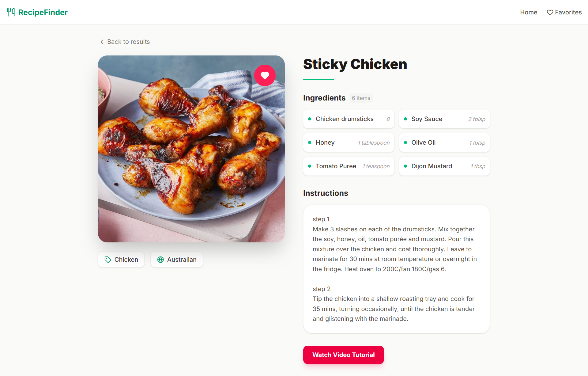
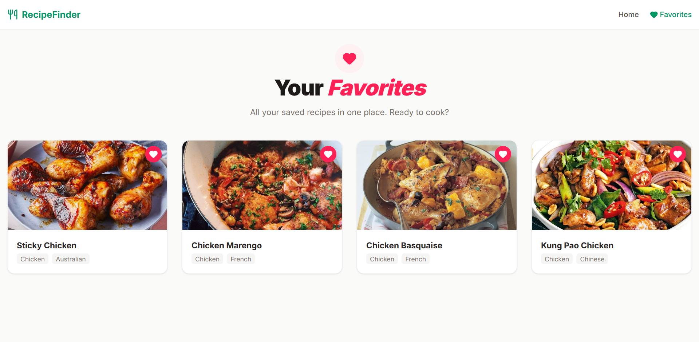

# 🍽️ Interactive Recipe Finder

A modern and responsive React application that allows users to search for recipes using a public API, view detailed recipe information, and manage a list of favorite recipes.

Built using **React (Vite)** with clean architecture and best coding practices.

---

## 🚀 Live Demo
  
Example: https://interactive-recipe-finder.vercel.app

---

## 📌 Features

### 🔍 Search Recipes
- Search recipes by **name**
- Search recipes by **main ingredient**
- Displays recipe image and title in a responsive grid layout

### 📖 Recipe Details
- View detailed recipe information
- Displays:
  - Recipe Name
  - Image
  - Category
  - Area (Cuisine)
  - Instructions
  - Ingredients with measurements
- Ingredients are dynamically extracted from API response

### ❤️ Favorites System
- Add or remove recipes from favorites
- Dedicated Favorites page
- Favorites persist using **localStorage**
- Data remains saved after page refresh

### 🎨 UI & UX
- Clean and modern design
- Fully responsive (mobile, tablet, desktop)
- Loading spinner during API calls
- Error handling for API failures
- “No results found” message
- Simple and intuitive navigation

---

## 🛠️ Tech Stack

- **React (Vite)**
- **JavaScript (ES6+)**
- **React Router**
- **Context API**
- **CSS**
- **TheMealDB Public API**

---

## 🔌 API Used

This project uses the free public API:

**TheMealDB API**  
https://www.themealdb.com/api.php

Endpoints used:

- Search by name  
  `https://www.themealdb.com/api/json/v1/1/search.php?s={name}`

- Search by ingredient  
  `https://www.themealdb.com/api/json/v1/1/filter.php?i={ingredient}`

- Lookup by ID  
  `https://www.themealdb.com/api/json/v1/1/lookup.php?i={id}`

---

## 🧠 Design Decisions

- Used **functional components and React Hooks** for modern React development.
- Implemented **Context API** instead of Redux to keep state management simple.
- Separated API logic into a dedicated `api.js` service file.
- Kept components small and reusable.
- Used localStorage for lightweight persistence.
- Structured project folders for scalability and maintainability.

---

## ⚙️ Setup & Installation

Follow these steps to run the project locally:

### 1️⃣ Clone the repository

```bash
git clone https://github.com/your-username/interactive-recipe-finder.git

```

### 2️⃣ Navigate to the project directory

```bash
cd interactive-recipe-finder
```      

### 3️⃣ Install dependencies

```bash
npm install

```

### 4️⃣ Start the development server

```bash
npm run dev
```      
### 5️⃣ Open in browser

Open [http://localhost:5173](http://localhost:5173) to view the app.


---

## 📸 Application Screenshots

### 🏠 Home Page


---

### 📖 Recipe Details Page


---

### ❤️ Favorites Page
# interactive-recipe-finder
